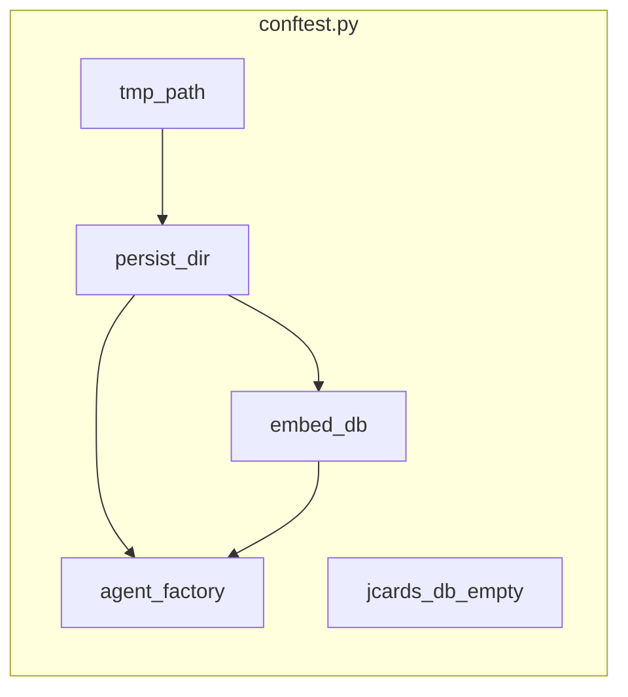
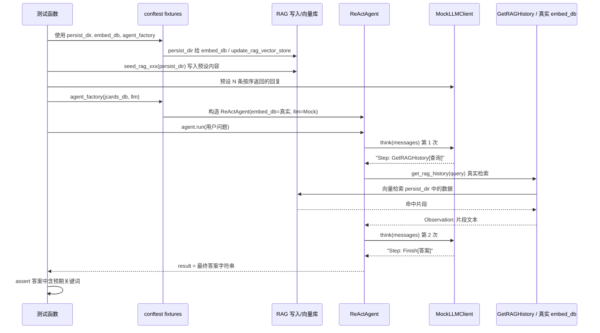

# Pytest 测试结构与数据流说明

本文档面向不熟悉 pytest 的读者，说明当前测试的**目录结构**、**数据流**和**为何能证明程序能运行**。

---

## 一、Pytest 与项目中的结构

### 1.1 什么是 pytest？

- **pytest** 是 Python 的测试框架。你写以 `test_` 开头的函数，运行 `pytest tests/` 时，pytest 会自动发现并执行这些函数。
- 若某条 `assert` 失败，该测试失败；全部通过则说明「在这些场景下程序行为符合预期」。

### 1.2 本项目的测试目录结构

```
tests/
├── conftest.py              # 公共配置与 fixture（见下）
├── README.md                # 运行说明（依赖、跳过原因等）
├── test_level1_basic_recall.py   # 第一层：单会话基础回忆
├── test_level2_multi_session.py # 第二层：多会话整合与冲突
└── test_level3_proactive.py     # 第三层：主动服务（Jcards + 提醒）
```

- **conftest.py**：pytest 约定，该文件中的 **fixture** 会被同目录及子目录下的测试自动发现并使用，无需在每个测试文件里重复写「建临时目录、建 Agent」等代码。
- **test_*.py**：每个文件里是若干 `test_xxx` 函数，每个函数是一个独立用例。

---

## 二、conftest.py：公共 fixture 与「假」依赖

[conftest.py](tests/conftest.py) 做了三件事：

### 2.1 把项目根目录加入 `sys.path`

这样在测试里可以直接 `from group1.xxx`、`from group3.xxx`，和实际运行时代码的导入方式一致。

### 2.2 两个 Mock 类（替代真实外部依赖）


| 类名                | 作用                                                    | 为何需要                          |
| ----------------- | ----------------------------------------------------- | ----------------------------- |
| **MockJcardsDb**  | 实现 `get_Jcards_tostr()`，返回你预先写好的「卡片字符串列表」             | 不依赖真实 jcards 服务/数据库，测试可控、可重复。 |
| **MockLLMClient** | 实现 `think(messages, temperature)`，按顺序返回你预先写好的「LLM 回复」 | 不调用真实大模型，避免网络、延迟、结果不稳定。       |


也就是说：**测试里「用户问什么、Agent 先检索再回答」的流程是真实的；但「LLM 说什么」和「Jcards 里有什么」是测试代码写死的。**

### 2.3 四个 Fixture（测试的「原材料」）

pytest 的 **fixture** 可理解为「测试用的预制件」：测试函数通过参数声明需要哪些 fixture，pytest 在运行前自动创建并注入。


| Fixture             | 含义                                                                                 | 依赖                                              |
| ------------------- | ---------------------------------------------------------------------------------- | ----------------------------------------------- |
| **persist_dir**     | 每个测试专用的临时目录（如 `tmp_path/vector_store`），用于存放向量库                                     | pytest 内置的 `tmp_path`                           |
| **embed_db**        | 真实的 `Embed_db`（RAG 用），但数据目录是上面的 `persist_dir`                                      | `persist_dir`；若无 `sentence_transformers` 会 skip |
| **jcards_db_empty** | 一个「空 Jcards」的 Mock，即 `MockJcardsDb([])`                                            | 无                                               |
| **agent_factory**   | 工厂函数：`(jcards_db, llm_client) -> ReActAgent`，用 `persist_dir` 和 `embed_db` 构造 Agent | `persist_dir`, `embed_db`                       |


数据流关系可以概括为：




---

## 三、三层测试的数据流（为什么能证明程序能跑）

程序核心链路是：**用户问题 → ReAct Agent（LLM 决定调用 GetRAGHistory / GetJcards 等）→ 工具执行（真实 RAG/Jcards 或 Mock）→ LLM 再根据观察给出 Finish[答案] → 断言答案内容**。

下面按「数据怎么准备 → 怎么跑 → 断言什么」说明每一层。

### 3.1 Level 1：单会话基础回忆（test_level1_basic_recall.py）

**要证明的事**：RAG 里存过「支票账户 12345678」后，用户问「我的支票账户号码是多少？」时，Agent 能通过 GetRAGHistory 查到并回答出 12345678。

**数据流**：

1. **准备 RAG 数据**：`seed_rag_checking_account(persist_dir)` 调用 `group3.rag_ingest_incremental.update_rag_vector_store`，在**本测试专用的** `persist_dir` 里写入一条内容：「用户说：我的支票账户号码是 12345678。」
2. **准备 Mock LLM 回复**：
  - 第 1 次调用：返回 `Step: GetRAGHistory[我的支票账户号码是多少]`（模拟「先检索」）。  
  - 第 2 次调用：返回 `Step: Finish[您的支票账户号码是 12345678。]`（模拟「根据检索结果给出答案」）。
3. **构造 Agent**：`agent_factory(jcards_db_empty, llm)` → 得到用**真实 RAG（embed_db + persist_dir）** 和 **Mock LLM / 空 Jcards** 的 ReActAgent。
4. **执行**：`agent.run("我的支票账户号码是多少？")`。
  - Agent 内部会：组 prompt → 调 LLM（Mock 返回第 1 条）→ 解析出 GetRAGHistory → **真实调用** `get_rag_history(...)`，从刚写入的向量库中检索 → 得到「12345678」那段文本 → 写入 history → 再调 LLM（Mock 返回第 2 条）→ 解析出 Finish → 返回最终答案字符串。
5. **断言**：`assert result is not None` 且 `assert "12345678" in result`。

**为何能证明程序能运行**：  
RAG 的写入（group3）、读取（GetRAGHistory → get_rag_history）、ReAct 的「解析 Step → 调工具 → 把观察写回 history → 再问 LLM」整条链路都跑通了；Mock 只固定了「LLM 说什么」，没有替代 RAG 和 Agent 逻辑，所以**能证明在单会话下，程序能正确回忆并回答**。

---

### 3.2 Level 2：多会话整合与事实冲突（test_level2_multi_session.py）

**要证明的事**：  

- **scatter_integration**：多轮/多会话里分别提到「丰田」「本田」，问「我有哪些车？」时，能整合成「丰田 + 本田」。  
- **fact_conflict**：同一会话里妻子/丈夫多次修改电汇指令，问「最终电汇指令」时，能给出「最后一条」（如账户 Z、150 元）。

**数据流**（以 scatter 为例）：

1. **准备 RAG**：`_seed_rag(persist_dir)` 返回的 `add` 往 `persist_dir` 里写两条：
  - session_jan：「用户说：我有一辆丰田车。」  
  - session_feb：「用户说：我有一辆本田车。」
2. **Mock LLM**：第 1 条让 Agent 调用 GetRAGHistory，第 2 条直接 Finish 一句包含「丰田」和「本田」的回复。
3. **Agent**：同样用 `agent_factory(jcards_db_empty, llm)`，RAG 是真实的多条数据。
4. **执行**：`agent.run("我有哪些车？")` → 真实 GetRAGHistory 会检索到两条会话的内容。
5. **断言**：`assert "丰田" in result and "本田" in result`。

**为何能证明**：  
多会话数据写入、向量检索能同时命中不同会话的片段、Agent 能把检索结果交给「下一步」（这里由 Mock 模拟）并产出整合答案；**证明多会话检索与整合路径是通的**。fact_conflict 同理，证明「多轮同会话、冲突事实」的检索与最终答案格式正确（含 Z 或 150）。

---

### 3.3 Level 3：主动服务（test_level3_proactive.py）

**要证明的事**：Jcards 里有「护照过期日 2025-02-18」和「东京航班 2025-01-15」，用户问「一月的东京之行还要准备什么」时，Agent 会**主动提到护照**（过期/续签/办理等）。

**数据流**：

1. **准备 Jcards**：不用空 Jcards，而是 `MockJcardsDb([卡片1, 卡片2])`，卡片字符串里包含 passport 过期日和东京航班信息。
2. **RAG**：本用例没有调用 `seed_rag`，即 RAG 可为空或仅依赖 persist_dir 的初始状态；重点在「Jcards 在 prompt 里被注入，Agent 能据此给建议」。
3. **Mock LLM**：第 1 条可带 GetRAGHistory（或仅依赖 Jcards），第 2 条返回带「护照」和「过期/续签/办理」的 Finish。
4. **Agent**：`agent_factory(jcards, llm)`，这里传入的是带两张卡片的 MockJcardsDb。
5. **执行**：`agent.run("为一月的东京之行，还有什么要准备的吗？")`。
  - ReAct 在组 prompt 时会调用 `jcards_db.get_Jcards_tostr()`，所以 Agent 能看到两张卡片内容；后续由 Mock 模拟「根据 Jcards 给出提醒」。
6. **断言**：`assert "护照" in result` 且 `assert any(kw in result for kw in ["过期", "续签", "办理"])`。

**为何能证明**：  
Jcards 通过 `get_Jcards_tostr()` 被正确注入到 ReAct 的上下文中，Agent 的 run 流程（含工具列表、Step 解析、Finish 返回）都执行了；**证明在「Jcards + 问题」下，程序能产出与护照相关的主动提醒**。

---

## 四、整体数据流小结（Mermaid）




---

## 五、为什么这些测试能「证明程序能够运行」？

1. **真实用到的代码路径**：
  - RAG：`group3.rag_ingest_incremental.update_rag_vector_store`、`group1` 的 `get_rag_history` 与 `Embed_db`。  
  - Agent：`group1.ReAct` 的 `run` → `_process_single_turn`、Step 解析、`ToolExecutor` 调用、`_wrap_get_rag_history`。  
  - Jcards：在 L3 通过 MockJcardsDb 模拟接口，但 Agent 侧调用 `get_Jcards_tostr()` 和把 Jcards 放进 prompt 的逻辑是真实的。
2. **Mock 只替代「不可控/外部」部分**：
  - LLM：避免真实 API、延迟与随机性。  
  - Jcards 数据源：用内存中的列表替代真实 DB/服务。  
   这样既保证**行为可重复**，又保证**业务逻辑与集成路径**是真实执行的。
3. **断言针对「业务结果」**：
  不只看「没报错」，而是检查最终答案里是否包含「12345678」「丰田」「本田」「Z/150」「护照」「过期/续签/办理」等，即**验证的是「用户记忆 + 检索 + 回答」的端到端效果**。
4. **隔离与可重复**：
  每个测试用独立的 `tmp_path`/`persist_dir` 和独立的 Mock 实例，互不干扰，也不依赖外部服务或全局状态，所以**能稳定、重复地证明在这些场景下程序能够运行并给出正确结果**。

---

## 六、运行与跳过说明

- 命令：在项目根目录执行 `python -m pytest tests/ -v`。  
- 若未安装 `sentence_transformers`，`embed_db` fixture 会 `importorskip`，依赖它的测试会被 **skip**（见 [tests/README.md](tests/README.md)）。  
- 安装 RAG 依赖后，四个用例应全部执行并通过，从而证明上述三条层次（基础回忆、多会话整合/冲突、主动服务）在当前实现下是通的。

