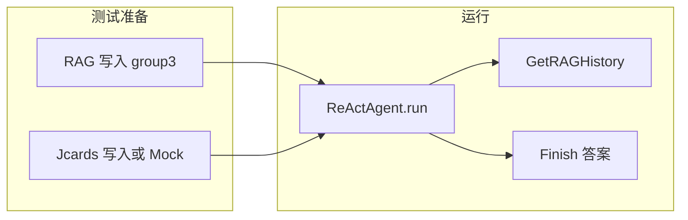

# 三层次用户记忆系统测试计划

## 1. 现状与依赖

- **入口**：[group1/ReAct.py](group1/ReAct.py) 中 `ReActAgent.run(question)` 单次调用返回 `Optional[str]`；`start_interactive_session()` 为交互式多轮。测试需可程序化调用 `agent.run(question)` 并对返回值做断言。
- **数据流**：
  - **RAG**： [group1/RAG_query.py](group1/RAG_query.py) 的 `return_reranked_chunks` 使用 [group3/rag_vector_store.py](group3/rag_vector_store.py)（SQLite 向量库）和 [group3/rag_ingest_incremental.py](group3/rag_ingest_incremental.py)（写入、上下文前缀）。[group1/ToolExecutor.py](group1/ToolExecutor.py) 中 `update_rag_vector_store` 当前为 `pass`，实际写入在 group3 的 `update_rag_vector_store` / `write_memory_events`。
  - **Jcards**：[group1/RAG_query.py](group1/RAG_query.py) 的 `Jcards_db.get_Jcards_tostr()` 从 jcards 服务取卡片；[group1/ToolExecutor.py](group1/ToolExecutor.py) 中 `update_jcards_database` 目前返回空列表，Jcards 写入依赖 jcards 服务或后续对接。
- **测试隔离**：每个用例或层次应使用**独立向量库目录**（如 `tests/fixtures/vector_store_l1`）和可清理/可 mock 的 Jcards，避免互相污染。

---

## 2. 测试框架与基础设施

- **运行器**：使用 **pytest**，在项目根目录新增 `tests/`，根目录增加 `pytest.ini` 或 `pyproject.toml` 的 pytest 配置，保证可发现 `tests/` 且能 import `group1`、`group3`、`jcards`（通过 `sys.path` 或包结构）。
- **公共 fixture**（建议 `tests/conftest.py`）：
  - **临时向量库目录**：`tmp_path` 或固定 `tests/.vector_store_<level>`，在用例前清空或创建，传入 `Embed_db(persist_dir=...)` 和 group3 的 `persist_dir`。
  - **Agent 工厂**：根据给定的 `persist_dir`、Jcards 数据源（真实 `Jcards_db` 或返回预设列表的 mock）构造 `LLMCompatibleClient` + `ToolExecutor` + `Jcards_db` + `Embed_db`，返回 `ReActAgent` 实例，便于各层次复用。
- **可选**：对 LLM 的封装做一层抽象（如 `LLMCompatibleClient` 接口），在测试中注入 **Mock LLM**：按固定顺序返回预设的 `Thought` + `Step: GetRAGHistory[...]` / `Step: Finish[...]`，用于不依赖真实 API 的稳定回归；与“真实 LLM 端到端”的验收测试分开。

---

## 3. 第一层次：基础回忆

- **目标**：单次会话内用户提供的具体信息能被准确回忆（如“我的支票账户号码是多少？”）。
- **数据准备**：
  - 使用 group3 的 **写入入口** 向测试专用向量库写入**一条**对话片段，内容包含明确事实，例如：“用户说：我的支票账户号码是 12345678。”  
  - 写入方式二选一或并存：  
    - 调用 [group3/rag_ingest_incremental.py](group3/rag_ingest_incremental.py) 的 `write_memory_events`，传入一条 `MemoryEvent`（含 `conversation_id`、`turn_id`、`speaker`、`text`）；或  
    - 调用同模块的 `update_rag_vector_store(action="Add", concluded_content="用户说：我的支票账户号码是 12345678。", conversation_id=..., turn_id=1, speaker="user", timestamp=..., persist_dir=测试目录)`。
  - 确保 `Embed_db` 与 RAG 查询使用**同一 persist_dir**，以便 `GetRAGHistory` 能召回该片段。
- **执行**：构造使用上述向量库和（可选）空 Jcards 的 `ReActAgent`，调用 `agent.run("我的支票账户号码是多少？")`。
- **通过标准**：返回值非 `None`，且返回字符串中**包含** “12345678”（或你约定的账户号）。若使用 Mock LLM，则断言 Mock 被调用的最后一步为 `Finish[...]` 且内容包含该事实。

---

## 4. 第二层次：多会话检索

### 4.1 整合分散信息

- **目标**：跨多会话整合信息（如用户在不同会话中分别提到两辆车，Agent 能综合回答“我有哪些车？”）。
- **数据准备**：
  - 向测试向量库写入**两条**来自不同会话的片段，例如：  
    - 会话 A：`conversation_id="session_jan"`，内容含“我有一辆丰田车”；  
    - 会话 B：`conversation_id="session_feb"`，内容含“我有一辆本田车”。
  - 仍通过 `write_memory_events` 或 `update_rag_vector_store` 两次 Add，使用不同 `conversation_id` 与合适 `turn_id`/`speaker`/`timestamp`。
- **执行**：`agent.run("我有哪些车？")` 或 “我拥有几辆车，分别是什么？”。
- **通过标准**：返回值中同时出现“丰田”和“本田”（或等价表述）；或 Mock 下至少一次调用 `GetRAGHistory`，且最终 `Finish` 包含两车信息。

### 4.2 处理事实冲突

- **目标**：多人在不同会话中先后修改同一指令时，能依据上下文判断**最终有效**指令（README 示例：妻子设电汇 → 丈夫修改 → 妻子再修改）。
- **数据准备**：
  - 依赖 **上下文前缀**：group3 的 `build_context_prefix` 与 `_build_summary_record` 会为每个 chunk 生成“时间/参与者/主题”前缀。  
  - 写入**三条**带明确上下文语义的片段，例如：  
    - Chunk1：`[上下文：妻子设立初始电汇] 向账户X转账100元`；  
    - Chunk2：`[上下文：丈夫修改电汇] 向账户Y转账200元`；  
    - Chunk3：`[上下文：妻子在丈夫修改后再次修改] 向账户Z转账150元`。
  - 实现时需保证写入的 `concluded_content` 或 `text` 包含上述前缀（或通过 group3 的 intent/participants 机制生成），并保持时间或 turn 顺序（如不同 `conversation_id` 或同一 conversation 下 turn_id 递增），以便检索与重排能区分先后。
- **执行**：`agent.run("最终的电汇指令是什么？请说明应向哪个账户转多少。")` 或类似。
- **通过标准**：返回值中体现**最终**指令为“账户Z、150元”（或妻子最后修改的版本）；若模型未明确写出，可退化为：至少召回了含“妻子再次修改”的 chunk，且答案未错误采用仅丈夫或仅第一次妻子的版本。

---

## 5. 第三层次：主动服务

- **目标**：主动发现隐藏关联并给出预警（示例：数月前提到护照即将过期 + 最近预订国际机票 → 主动提醒续签护照）。
- **数据准备**：
  - **Jcards**：在测试中写入或 Mock 两张“核心事实”卡片，例如：  
    - 护照：过期日 2025-02-18（或 1 月东京行之前）；  
    - 机票：1 月 15 日飞往东京。
  - 若当前 `Jcards_db` 依赖真实服务且 `update_jcards_database` 仍为 stub，可先 **Mock `Jcards_db.get_Jcards_tostr()**` 返回包含上述两条的字符串列表；或对接 jcards 服务后，在测试前通过 API 写入对应卡片。  
  - **RAG**（可选）：写入与“护照”“东京行程”相关的对话片段，便于 Agent 用 GetRAGHistory 找证据。
- **执行**：`agent.run("为一月的东京之行，还有什么要准备的吗？")`（不直接问护照）。
- **通过标准**：返回值中**主动提及**护照相关风险，例如出现“护照”且（“过期”或“续签”或“办理”）之一；不必用户先问“护照怎么办”才回答。

---

## 6. 实施顺序与文件建议

| 步骤  | 内容                                                                                                                                                                            |
| --- | ----------------------------------------------------------------------------------------------------------------------------------------------------------------------------- |
| 1   | 新增 `tests/` 目录、`conftest.py`（临时/专用向量库、Agent 工厂、可选 Mock LLM），配置 pytest。                                                                                                        |
| 2   | 实现 **第一层次** 用例：准备单条 RAG 片段 → `run("我的支票账户号码是多少？")` → 断言包含约定数字。                                                                                                                |
| 3   | 实现 **第二层次** 用例：4.1 两会话两车 + 4.2 三条电汇冲突；断言整合结果与最终有效指令。                                                                                                                          |
| 4   | 实现 **第三层次** 用例：Jcards（或 Mock）含护照+机票 → `run("为一月东京之行还有什么要准备？")` → 断言主动提到护照/续签。                                                                                                 |
| 5   | 可选：在 `group1/ToolExecutor.py` 中将 `update_rag_vector_store` 委托给 group3 的 `update_rag_vector_store`（并统一 `persist_dir`），使 Agent 在交互或测试中调用 UpdateRAG 时真正写入当前向量库，便于“先对话再提问”的端到端测试。 |

- **建议文件布局**：  
  - `tests/conftest.py`：fixtures（向量库路径、Embed_db、Jcards_db mock、ReActAgent 工厂）。  
  - `tests/test_level1_basic_recall.py`：第一层次。  
  - `tests/test_level2_multi_session.py`：第二层次（分散整合 + 事实冲突）。  
  - `tests/test_level3_proactive.py`：第三层次。  
  - 若使用真实 LLM，可加 `tests/e2e_*` 或环境变量开关（如 `RUN_E2E=1`）区分快速单元测试与耗时的端到端测试。

---

## 7. 风险与说明

- **LLM 非确定性**：真实 API 下同一问题可能有时答对有时答错，建议：验收时多跑几次或接受一定 flakiness；CI 中可用 Mock LLM 做稳定回归。  
- **ToolExecutor 与 group3 未完全打通**：若未将 `ToolExecutor.update_rag_vector_store` 接到 group3，测试中的数据准备必须**直接调用 group3** 的写入接口，并保证 Agent 查询时使用的 `Embed_db` 指向同一 `persist_dir`。  
- **Jcards 写入**：若 `update_jcards_database` 仍为空实现，第三层次测试依赖 **Mock Jcards** 或真实 jcards 服务预置数据；待 jcards 写入对接后，再改为通过工具或 API 准备测试卡片。

