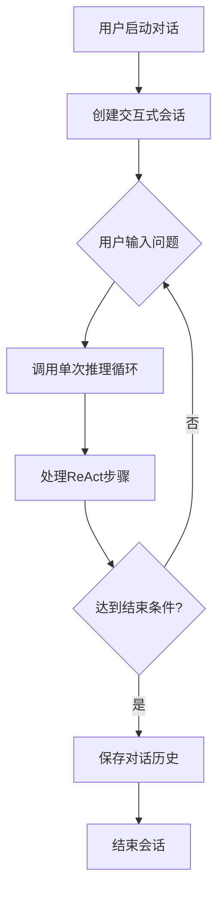

# 改进ReActAgent对话机制

基于当前代码结构，实现多次对话循环功能：

## 总体架构

创建新的`start_interactive_session`方法来支持对话循环，保留原有`run`方法用于单次调用：




## 具体实现步骤

### 1. 新增交互式会话方法

- 创建`start_interactive_session()`方法
- 支持用户连续输入问题
- 提供退出命令（如 'quit', 'exit', '再见'）
- 保持对话历史连续性

### 2. 保持现有run方法兼容性

- 保留现有`run`方法用于单次调用
- 在交互式会话中复用单次推理逻辑

### 3. 增强对话历史管理

- 修改历史记录格式，支持多轮对话
- 在交互式会话中累积历史
- 支持对话历史持久化

### 4. 改进输出格式

- 提供清晰的对话边界标识
- 支持用户友好的交互提示
- 优化显示效果

## 文件修改

主要修改文件：`group1/ReAct.py`：

- 在`ReActAgent`类中添加`start_interactive_session`方法
- 优化`run`方法的历史管理
- 添加会话控制逻辑

## 代码实现示例

新增交互式会话方法的核心逻辑：

```python
def start_interactive_session(self):
    """启动交互式对话会话"""
    print("\n=== ReAct Agent 交互式会话 ===")
    print("输入 'quit', 'exit' 或 '再见' 结束对话\n")
    
    self.history = []  # 重置历史，但会累积对话
    
    while True:
        user_input = input("👤 您：").strip()
        
        # 结束条件
        if user_input.lower() in ['quit', 'exit', '再见']:
            print("🤖 Agent：再见！感谢与您的对话。")
            break
            
        if not user_input:
            continue
            
        # 调用单次推理处理用户输入
        result = self._process_single_turn(user_input)
        print(f"🤖 Agent：{result}\n")
```

这样实现既能保持现有功能的兼容性，又能提供完整的多次对话能力。